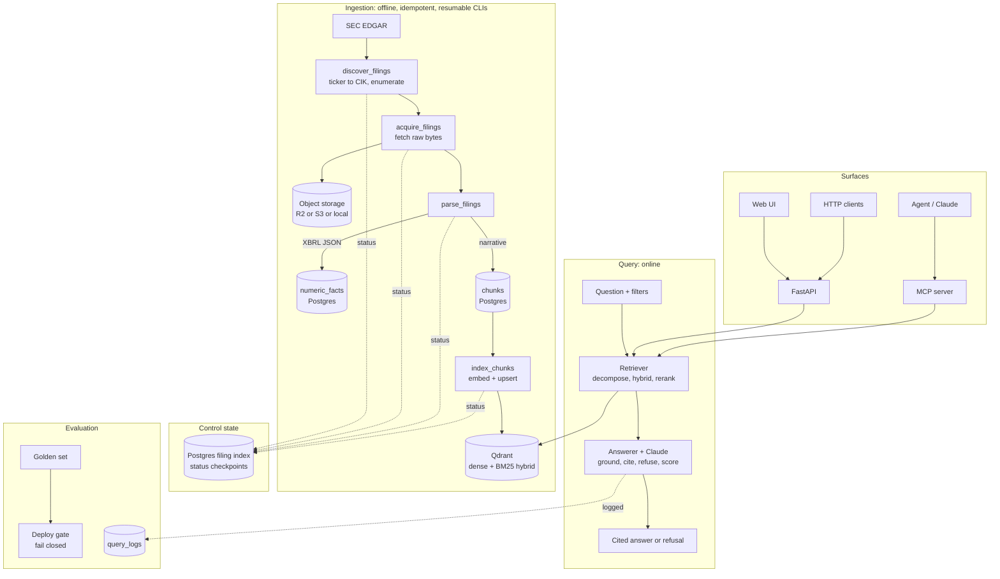
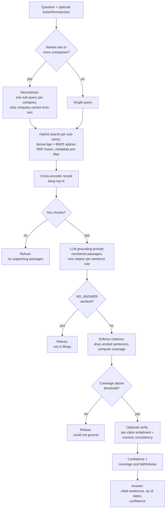

# SEC RAG: Grounded Filings Answer Engine

A grounded answer engine over SEC filings (10-K, 10-Q, 8-K, earnings transcripts).
You ask a question over the filing corpus and get a numbers-correct, span-cited
answer with an "as of" date, or an explicit "not supported by any filing."

Every claim is cited to a source span. The system scores its own confidence,
refuses when nothing supports an answer, and blocks its own deploys when answer
accuracy regresses on a golden set.

> Status: Phase 8 complete, the roadmap is finished. The full pipeline (acquire to
> parse to embed to retrieve to generate to evaluate) is orchestrated by Airflow and
> served over HTTP (with a thin UI and metrics) and to agents via an MCP server.
> 109 tests plus 4 opt-in live tests, 92% coverage, mypy strict, ruff clean.

## Table of contents

- [What makes it different](#what-makes-it-different)
- [Two data planes](#two-data-planes)
- [System architecture](#system-architecture)
- [How a question is answered](#how-a-question-is-answered)
- [Component map](#component-map)
- [Technology choices](#technology-choices)
- [Requirements](#requirements)
- [Quickstart](#quickstart)
- [Configuration](#configuration)
- [Running the pipeline](#running-the-pipeline)
- [Serving](#serving)
- [Orchestration](#orchestration)
- [Evaluation and the deploy gate](#evaluation-and-the-deploy-gate)
- [Commands](#commands)
- [Design decisions](#design-decisions)
- [Known limitations](#known-limitations)
- [Repository layout](#repository-layout)
- [License](#license)

## What makes it different

Most retrieval-augmented systems retrieve text and hope the model stays faithful.
This one treats faithfulness as a set of enforced product features:

| Property | How it is enforced |
| --- | --- |
| Span citations | Every answer sentence must carry an in-range `[n]` marker, or it is dropped in code |
| Refusal | Empty retrieval, a `NO_ANSWER` sentinel, or sub-threshold citation coverage returns "not supported" instead of guessing |
| Numbers from structure | Financial figures come from XBRL, never parsed from HTML tables |
| Confidence | Surfaced per answer, from citation coverage and (when verifying) entailment faithfulness |
| As-of dating | Each citation carries its filing's period-of-report date, so cross-year facts are attributable |
| Deploy gate | A golden set blocks a deploy if faithfulness, citation hit rate, or refusal accuracy regress |
| Online logging | Every query, its retrieval set, and the grounding outcome are written to `query_logs` |

## Two data planes

The central design choice: never parse a balance-sheet table for numbers. Split the
corpus by data type.

| Plane | Source | Why | Lands in |
| --- | --- | --- | --- |
| Numbers | XBRL via the EDGAR CompanyFacts API | Structured, tagged, clean; no table parsing | `numeric_facts` |
| Narrative | Filing HTML (MD&A, risk factors) | Prose is chunked; hard parsing is confined here | `chunks` then Qdrant |

This keeps numeric correctness mechanical and isolates fragile HTML parsing to text.

## System architecture



Airflow sits above the ingestion CLIs as a control plane only. It triggers the
steps and polls for completion; it never parses or embeds inside its own workers.
Each step checkpoints by filing status, so a scheduled re-run processes only new
filings.

## How a question is answered



Two retrieval details worth calling out, both learned from real failures:

- Table-of-contents pages are detected and dropped during chunking, so a filing's
  forward-looking-statements preamble cannot masquerade as a real item section and
  pollute retrieval.
- In a comparison, each decomposed sub-query is filtered to one company by ticker,
  so the company names are stripped from the query text. The names would otherwise
  dilute the embedding and pull generic business-overview passages over the actual
  risk factors.

## Component map

| Layer | Package | Responsibility |
| --- | --- | --- |
| Acquisition | `app/edgar` | Polite, rate-limited EDGAR client behind a Protocol; discovery and raw fetch |
| Storage | `app/storage` | `RawStore` over R2/S3 or local filesystem, with traversal-safe keys |
| Index | `app/index` | SQLAlchemy 2.0 models, repository, idempotent upserts, `query_logs` |
| Numbers | `app/xbrl` | CompanyFacts JSON to `numeric_facts` |
| Narrative | `app/narrative` | HTML extract, TOC-aware sectioning, parent/child chunks with citation offsets |
| Embedding | `app/embedding` | `Embedder` Protocol: fastembed CPU (default) or RunPod GPU |
| Vector store | `app/vectorstore` | `QdrantIndex` hybrid search (dense + sparse, RRF) |
| Retrieval | `app/retrieval` | Filters, cross-encoder rerank, comparison decomposition, `Retriever` |
| Generation | `app/generation` | Grounding prompt, citation enforcement, refusal, confidence, `Answerer` |
| Evaluation | `app/eval` | Entailment verifier, numeric check, golden set, deploy gate |
| Serving | `app/serving` | FastAPI, thin UI, Prometheus metrics, MCP server |

Every external dependency sits behind a Protocol with a fake used in the test gate,
so the whole system is testable without network, GPU, or model spend.

## Technology choices

| Concern | Choice | Reason |
| --- | --- | --- |
| Env and deps | uv | Fast, lockfile-based, reproducible; single tool for venv and resolution |
| Lint and format | ruff | One fast tool replacing black, isort, flake8 |
| Types | mypy strict | This is a data pipeline; silent type drift is expensive |
| Tests | pytest plus coverage | Fixtures for integration tests; testcontainers Postgres |
| Raw storage | Cloudflare R2 (S3 API) | No egress fees; S3-compatible so portable |
| Filing index | Postgres | Relational checkpoints keyed on accession; ON CONFLICT upserts |
| Vectors | Qdrant | First-class metadata filtering; clean local story (in-memory in tests) |
| Embeddings | bge-small-en-v1.5 (fastembed) | Strong small CPU model; RunPod GPU path for scale |
| Reranking | ms-marco MiniLM cross-encoder | Precision pass over hybrid candidates |
| Answer model | Anthropic Claude | Default `claude-haiku-4-5` for cost; raise `LLM_MODEL` for quality |
| Orchestration | Airflow | Control plane over standalone CLIs; idempotent, checkpointed, catchup-safe |
| Serving | FastAPI plus MCP | One core, three surfaces: people, software, agents |

## Requirements

- Python 3.12 (provisioned automatically by uv; pinned in `.python-version`).
- [uv](https://docs.astral.sh/uv/) for environment and dependency management.
- Docker, for the local Postgres index, Qdrant, and the test suite (testcontainers).
- git. An EDGAR identity is needed for live acquisition; R2 credentials, RunPod, and
  an LLM key are needed for the respective stages (see `.env.example`).

## Quickstart

```bash
git clone https://github.com/kartikeyamandhar/airflow_sec_rag.git sec_rag
cd sec_rag

# Create the environment from the lockfile and install dev tooling.
uv sync

# Install the git pre-commit hooks (ruff, mypy, hygiene). One time.
uv run pre-commit install

# Run the full local gate (lint, types, tests). Must exit 0.
make check
```

`uv sync` followed by `make check` should take a fresh clone to a green gate.

## Configuration

Configuration is read from the environment or a local `.env` via `pydantic-settings`.
Secrets are typed as `SecretStr`, so they are redacted in logs and `repr()`. Copy the
example and fill it in; never commit `.env` (only `.env.example`, with no values, is
tracked).

```bash
cp .env.example .env
```

| Key | Purpose | Default |
| --- | --- | --- |
| `EDGAR_IDENTITY` | User-Agent for EDGAR (your name and email). Required or EDGAR returns 403 | empty |
| `STORAGE_BACKEND` | `s3` for R2/S3, or `local` for the filesystem | `s3` |
| `R2_*` | R2 account, keys, bucket, and `R2_ENDPOINT_URL` | empty |
| `DATABASE_URL` | SQLAlchemy URL for the Postgres index | local Postgres on 5432 |
| `QDRANT_URL` | Qdrant endpoint | `http://localhost:6333` |
| `EMBEDDING_BACKEND` | `fastembed` (CPU) or `runpod` (GPU) | `fastembed` |
| `LLM_API_KEY` | Anthropic key for the answer model and judge | empty |
| `LLM_MODEL` | Answer model | `claude-haiku-4-5` |
| `ANSWER_MIN_CITATION_COVERAGE` | Refuse below this fraction of cited sentences | `0.5` |

The full surface, with descriptions, lives in
[configs/settings.py](configs/settings.py).

Note: if a local Postgres already occupies port 5432, run the project Postgres on
another port. The compose host port is overridable (`SEC_RAG_PG_PORT`); set it in
`infra/.env` and point `DATABASE_URL` at the same port.

## Running the pipeline

Acquisition runs in idempotent, resumable steps over a configured universe of
companies ([configs/universe.dev.yaml](configs/universe.dev.yaml)). Every step is
safe to re-run: completed work is skipped via the filing-status checkpoint.

```bash
# 1. Start the local Postgres index and Qdrant.
make db-up

# 2. Discover target filings (ticker to CIK, enumerate 10-K/10-Q) and record them.
uv run python -m scripts.discover_filings --config configs/universe.dev.yaml

# 3. Fetch and store raw artifacts: CompanyFacts JSON (numbers) per company and the
#    primary document (narrative) per filing.
uv run python -m scripts.acquire_filings

# 4. Parse: CompanyFacts JSON into numeric facts, and each filing into section-aware
#    parent/child text chunks with citation offsets.
uv run python -m scripts.parse_filings

# 5. Embed child chunks and load them into Qdrant. Default backend is local CPU
#    (fastembed); set EMBEDDING_BACKEND=runpod to use a deployed GPU endpoint.
uv run python -m scripts.index_chunks

# 6. Search: hybrid (dense + BM25) retrieval with metadata filtering and reranking.
uv run python -m scripts.search "what are Apple supply chain risks?" --ticker AAPL

# 7. Ask: retrieve, then generate a grounded, span-cited answer with an as-of date
#    and confidence, or refuse. Needs LLM_API_KEY. Add --verify to entailment-check
#    each claim and numeric-check figures.
uv run python -m scripts.answer "what are Apple supply chain risks?" --ticker AAPL

# 8. Evaluate against the golden set and apply the deploy gate (non-zero on
#    regression). Calls the answer and judge models, so run it with a budget.
uv run python -m scripts.evaluate --golden configs/golden.yaml
```

Run the whole ingestion chain (steps 2 to 5) in one command, no Airflow:

```bash
make pipeline
```

## Serving

Serve the engine over HTTP, with a thin browser UI and Prometheus metrics:

```bash
uv run uvicorn app.serving.api:app --reload   # UI at http://localhost:8000
```

| Endpoint | Method | Purpose |
| --- | --- | --- |
| `/` | GET | Thin HTML UI |
| `/answer` | POST | Grounded, cited answer or refusal |
| `/search` | POST | Reranked cited chunks (no model call) |
| `/health` | GET | Liveness |
| `/metrics` | GET | Prometheus metrics (`sec_rag_answers_total`) |

The service is for local/dev use; it has no auth and the answer endpoint spends model
credit, so add auth and rate limiting before any real exposure.

Expose retrieval and answering to an agent (Claude) as MCP tools (`search_filings`,
`answer_question`):

```bash
uv run python -m app.serving.mcp_server
```

This is the agentic bridge: rather than being an agent itself, the system is a
high-quality, evaluated, grounded tool that an agent can call. The hard guarantees
(citations, refusal, the eval gate) live in the tool, where they are testable.

## Orchestration

For scheduled, incremental ingestion, an Airflow DAG
([infra/airflow/dags/sec_rag_pipeline.py](infra/airflow/dags/sec_rag_pipeline.py))
shells out to the same CLIs as a control plane. Because each step checkpoints by
filing status, a scheduled run processes only new filings. The stack is heavy and
optional:

```bash
make airflow-up    # build and start Airflow (UI on http://localhost:8080)
make airflow-down
```

For production scale, set `EMBEDDING_BACKEND=runpod` so the index step embeds on a
RunPod GPU rather than the Airflow worker.

## Evaluation and the deploy gate

Evaluation is wired into the product, not run as a one-off study.

| Check | What it does | Where |
| --- | --- | --- |
| Grounding verifier | LLM judge confirms each cited claim is entailed by its evidence; unsupported claims are dropped | `app/eval/verifier.py` |
| Numeric consistency | Answer figures must appear in the cited evidence | `app/eval/numeric.py` |
| Confidence | Weakest link of citation coverage and entailment faithfulness | `app/eval/confidence.py` |
| Golden set | Held question/answer/source triples | `configs/golden.yaml` |
| Deploy gate | Fails closed if refusal accuracy, citation hit rate, or faithfulness regress | `scripts/evaluate.py` |

The gate runs at deploy time (it makes live model calls), separate from `make check`
so the PR gate stays free and fast.

## Commands

All commands run through `uv` so everyone uses the same pinned toolchain.

| Command | What it does |
| --- | --- |
| `make setup` | `uv sync` plus install pre-commit hooks |
| `make format` | Auto-format and auto-fix (ruff). Mutating |
| `make lint` | Lint and format-check (ruff). Non-mutating |
| `make type` | Type-check (mypy strict) |
| `make test` | Run tests with coverage (pytest) |
| `make check` | `lint`, `type`, `test`. The full gate |
| `make pipeline` | Run the ingestion chain (discover to index), no Airflow |
| `make db-up` / `make db-down` | Start or stop local Postgres and Qdrant |
| `make airflow-up` / `make airflow-down` | Start or stop the Airflow stack |

CI ([.github/workflows/ci.yml](.github/workflows/ci.yml)) runs the same `make`
targets on a clean runner, so local green and CI green stay in sync.

## Design decisions

Each significant decision is recorded as an Architecture Decision Record. The set:

| ADR | Decision |
| --- | --- |
| 0001 | Record decisions as ADRs |
| 0002 | Toolchain: uv, ruff, mypy strict, pytest, pre-commit |
| 0003 | EDGAR acquisition and R2 storage |
| 0004 | Postgres index with testcontainers |
| 0005 | HTML parsing and parent/child chunking |
| 0006 | Embedding and the Qdrant vector index |
| 0007 | Hybrid retrieval (dense + BM25, rerank, decomposition) |
| 0008 | Grounded generation with enforced citations |
| 0009 | Evaluation as product features |
| 0010 | Airflow as a control plane over standalone jobs |
| 0011 | Serving: FastAPI, metrics, and an MCP tool surface |

## Known limitations

| Area | Limitation |
| --- | --- |
| Numeric check | String membership, not unit-aware or cross-checked against XBRL |
| Entailment | Uses the LLM judge; a dedicated NLI model would be cheaper and more stable |
| Section detection | Heuristic; TOC pages are dropped, but exotic filing layouts can still mislabel |
| Decomposition | Heuristic, by named company; no general clause-level decomposition |
| Serving | Dev/local only: no auth, no rate limiting, single-process uvicorn |
| MCP | stdio transport is smoke-imported, not integration-tested |
| Scale | Freshness via status checkpoint, not bulk-ZIP plus last-seen for very large universes |

## Repository layout

```
app/        library code: clients, parsing, chunking, embedding, retrieval, generation, eval, serving
configs/    pydantic-settings models, company lists, run configs
data/       local scratch only, never committed
notebooks/  experiments
scripts/    CLI entrypoints (each an idempotent, resumable job)
tests/      unit and integration
docs/       architecture, ADRs, per-phase specs, progress log
infra/      Dockerfiles, compose (Postgres, Qdrant, Airflow), RunPod job specs
.github/    CI workflows
```

## License

MIT.
